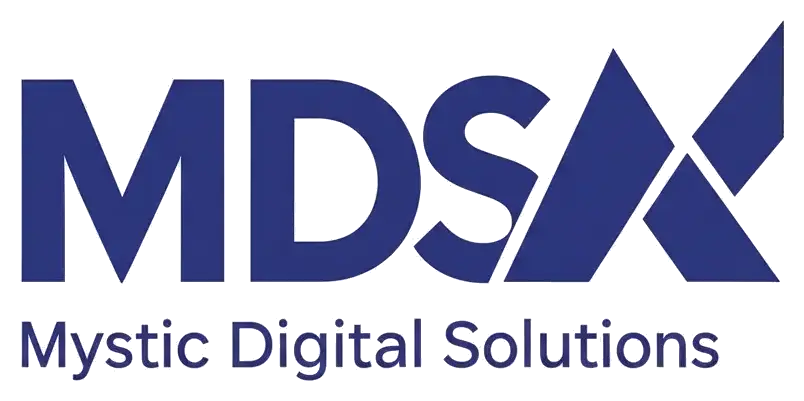

# Mystic Digital Solutions (MDS) — Agence Digitale en Afrique de l'Ouest



**Mystic Digital Solutions (MDS)** est une agence digitale spécialisée dans l'accompagnement des organisations africaines vers l'excellence numérique. Nous transformons les données en décisions et le code en croissance à travers des solutions sur mesure en Data Analytics, Développement Web, Automatisation et Consulting.

## 🚀 Fonctionnalités Clés

- **Expertise Multi-sectorielle** : Solutions dédiées pour la Santé, le BTP, les ONG, l'Éducation, le Juridique, la Fintech, etc.
- **Nos Réalisations Dynamique** : Vitrine interactive des réalisations concrètes avec filtrage sectoriel.
- **Communication Directe** : Intégration d'un bouton flottant WhatsApp pour une prise de contact instantanée.
- **Performance Optimisée** : Code minifié (CSS/JS) pour un temps de chargement ultra-rapide.
- **Conformité & Légalité** : Intégration des mentions légales (RCCM, IFU) et respect de la confidentialité (RGPD/Bénin).
- **SEO & Social Media** : Optimisation pour le référencement naturel et partage social (Open Graph).

## 🛠 stack Technique

- **Frontend** : HTML5, Vanilla CSS, JavaScript (ES6+).
- **Backend & Data** : Intégration Supabase (Contact Form).
- **Tracking** : Google Analytics 4 (GA4).
- **Performance** : Minification via Clean-CSS & Terser.
- **Déploiement** : Prêt pour Vercel / Netlify (Static Hosting).

## 📁 Structure du Projet

```text
├── index.html              # Page d'accueil
├── portfolio.html          # Page des réalisations (Filtres JS)
├── 404.html                # Page d'erreur personnalisée
├── css/
│   ├── style.css           # Styles sources (Vanilla CSS)
│   └── style.min.css       # Styles minifiés pour la production
├── js/
│   ├── main.js             # Logique applicative (Animations, Compteurs)
│   └── main.min.js         # Logique minifiée
├── secteurs/               # 10 pages dédiées par secteur d'activité
├── images/
│   ├── portfolio/          # Images des projets générées par IA
│   └── ...                 # Assets graphiques et logos
├── manifest.json           # Support PWA
└── sw.js                   # Service Worker (Cache & Offline)
```

## 💻 Installation Locale

1. Cloner le dépôt :
   ```bash
   git clone https://github.com/Mintjo/Mystic-Digital-Solutions.git
   ```
2. Ouvrir `index.html` avec un serveur local (ex: Live Server sur VS Code).

## 📬 Contact

- **Email** : contact@mysticdigitalsolutions.com
- **Téléphone / WhatsApp** : +229 01 47 25 89 53
- **Site Web** : [www.mysticdigitalsolutions.com](https://www.mysticdigitalsolutions.com)

---
*© 2026 MDS Digital Solutions. Tous droits réservés.*
